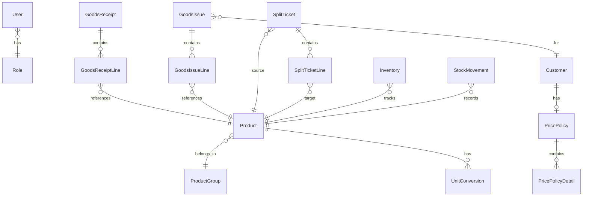

# Brainstorming Session Results — WMS Kick Off

**Facilitator:** Windy
**Date:** 2026-03-28

---

## Session Overview

**Topic:** Kick off dự án Warehouse Management System (WMS) cho doanh nghiệp kinh doanh vật liệu (cuộn/xấp/thùng)
**Goals:** Ước tính lịch & resource (báo giá) → Danh sách màn hình → Tech Stack → Data Model → UX Wireframes

**Context:** Dựa trên `requirement.md` (~540 dòng), hệ thống WMS gồm các phân hệ: Quản trị tài khoản & RBAC, Danh mục (Sản phẩm/Khách hàng/Bảng giá), Phiếu nhập, Phiếu xuất, Phiếu tách hàng, Quản lý tồn kho.

---

## Phase 1: Question Storming — Kết quả

### ✅ Đã biết — Không cần hỏi thêm

| # | Câu hỏi | Câu trả lời |
|---|---------|-------------|
| Q1 | Báo cáo NXT gồm cột gì? Xuất file không? | Đã có mẫu Excel sẵn → theo mẫu đó |
| Q10 | Nền tảng — Web / Desktop / Mobile? | **Desktop App** |
| Q12 | Nhân viên dùng điện thoại tại kho không? | Loại bỏ — desktop app |
| Q15 | On-premise hay cloud? Ai chịu hosting? | Cloud hosting — đội dev chịu trách nhiệm |

### ❓ Câu hỏi cần hỏi khách hàng (20 câu)

#### 🗂️ Nghiệp vụ & Scope
- **Q2.** Phiếu nhập có gắn với nhà cung cấp không? Hay chỉ ghi "nhập kho" thuần tuý?
- **Q3.** Hệ thống quản lý 1 kho hay nhiều kho? Có tính năng chuyển kho không?
- **Q4.** Có cần theo dõi công nợ / thanh toán sau khi xuất hàng không?
- **Q5.** Khi tách hàng tạo sản phẩm mới — mã do hệ thống tự sinh hay nhân viên nhập tay?
- **Q6.** Đơn giá gốc sản phẩm được nhập ở đâu? Có bảng giá nhập riêng không?
- **Q7.** Có cần in phiếu nhập / xuất / tách theo mẫu in cụ thể không?
- **Q8.** Có vai trò thứ ba nào không? (Kế toán xem báo cáo, BGĐ xem dashboard...?)

#### 👥 Người dùng & Quy mô
- **Q9.** Bao nhiêu nhân viên dùng đồng thời? Quy mô tối đa?
- **Q11.** Nhân viên làm việc ở một địa điểm hay nhiều chi nhánh?

#### 🔗 Tích hợp & Hạ tầng
- **Q13.** Có cần tích hợp phần mềm kế toán hiện tại không? (MISA, FAST, Excel...)
- **Q14.** Dữ liệu cũ (tồn kho, khách hàng, sản phẩm) có cần migrate vào hệ thống mới không?
- **Q16.** Có cần API để bên thứ ba kết nối không?

#### 📊 Báo cáo & Vận hành
- **Q17.** Admin điều chỉnh tồn thủ công — có cần phiếu điều chỉnh riêng với lý do bắt buộc không?
- **Q18.** Audit log — ghi lại lịch sử ai sửa/xóa phiếu không? Giữ bao lâu?
- **Q19.** Có cần dashboard tổng quan (doanh thu, cảnh báo tồn thấp...) không?
- **Q20.** Khi tồn kho âm — block hoàn toàn hay warning + override với quyền đặc biệt?

#### 🔄 Edge Cases
- **Q21.** Phiếu xuất có thể xuất một sản phẩm bằng nhiều đơn vị tính trên cùng một phiếu không?
- **Q22.** Có cần tính năng "giữ hàng" (reserve stock) chưa xuất chính thức không?
- **Q23.** Cuộn hàng đã tách có thể tách tiếp lần 2 không? (nested split)
- **Q24.** Chính sách giá thay đổi theo thời gian — có lưu lịch sử giá không?

---

## Phase 2: Mind Mapping — Work Breakdown Structure

### Module 1: Auth & User Management

| Screen ID | Tên màn hình | REQ | Ghi chú |
|-----------|---|---|---|
| S01 | Màn hình Login | REQ 2.1.1 | |
| S02 | Danh sách tài khoản (Admin) | REQ 2.1.1 | Search, filter theo role, khóa/mở khóa |
| S03 | Form tạo / chỉnh sửa tài khoản | REQ 2.1.1 | Admin only |
| S04 | Đổi mật khẩu (self-service) | REQ 2.1.1 | Người dùng tự thực hiện |
| S05 | Reset mật khẩu (Admin) | REQ 2.1.1 | Admin reset cho người dùng khác |
| S06 | Quản lý Roles & Phân quyền | REQ 2.1.2 | RBAC config — Admin / Nhân viên |

### Module 2: Danh mục

| Screen ID | Tên màn hình | REQ | Ghi chú |
|-----------|---|---|---|
| S07 | Danh sách Sản phẩm | REQ 2.2.1 | Search, filter theo nhóm hàng |
| S08 | Form tạo / chỉnh sửa Sản phẩm | REQ 2.2.1 | Thuộc tính cuộn, config quy đổi đơn vị |
| S09 | Danh sách Khách hàng | REQ 2.2.2 | Search theo tên, mã |
| S10 | Form tạo / chỉnh sửa Khách hàng | REQ 2.2.2 | Thông tin liên hệ, ghi chú |
| S11 | Cấu hình Bảng giá & Chiết khấu | REQ 2.2.3 | Per-customer, per-product discount |
| S12 | Quản lý Nhóm hàng (Category) | REQ 2.2.1 | *(implicit — nhóm hàng là field của sản phẩm)* |
| S13 | Nhập / cập nhật đơn giá gốc sản phẩm | REQ 2.2.1, 2.2.3 | ⚠️ TBD — phụ thuộc **Q6** |

### Module 3: Phiếu nhập hàng

| Screen ID | Tên màn hình | REQ | Ghi chú |
|-----------|---|---|---|
| S14 | Danh sách Phiếu nhập | REQ 2.3.1 | Filter ngày, người lập; sort, search |
| S15 | Tạo / chỉnh sửa Phiếu nhập | REQ 2.3.2, 2.3.3 | Draft → Confirm; auto tồn kho khi confirm |
| S16 | Chi tiết Phiếu nhập (read-only) | REQ 2.3.2 | View full info |
| S17 | Quản lý Nhà cung cấp + gắn vào Phiếu nhập | REQ 2.3.2 | ⚠️ TBD — phụ thuộc **Q2** |
| S18 | In / xuất PDF Phiếu nhập | REQ 2.3.2 | ⚠️ TBD — phụ thuộc **Q7** |

### Module 4: Phiếu xuất hàng

| Screen ID | Tên màn hình | REQ | Ghi chú |
|-----------|---|---|---|
| S19 | Danh sách Phiếu xuất | REQ 2.4.1 | Filter ngày, KH, người lập; trạng thái |
| S20 | Tạo / chỉnh sửa Phiếu xuất | REQ 2.4.2, 2.4.3, 2.4.4, 2.4.5 | Auto-price, discount, kiểm tra tồn kho |
| S21 | Chi tiết Phiếu xuất (read-only) | REQ 2.4.2 | Hiển thị đầy đủ dòng sản phẩm + giá |
| S22 | Hủy Phiếu xuất (Admin) | REQ 2.4.5, 2.4.6 | Hoàn tồn kho khi hủy |
| S23 | In / xuất PDF Phiếu xuất | REQ 2.4.2 | ⚠️ TBD — phụ thuộc **Q7** |

### Module 5: Phiếu tách hàng

| Screen ID | Tên màn hình | REQ | Ghi chú |
|-----------|---|---|---|
| S24 | Danh sách Phiếu tách | REQ 2.5.1 | Filter ngày, sản phẩm, trạng thái, người lập |
| S25 | Tạo / chỉnh sửa Phiếu tách | REQ 2.5.2, 2.5.3, 2.5.4 | Chọn cuộn gốc, nhập số lượng tách, tạo SP mới |
| S26 | Chi tiết Phiếu tách (read-only) | REQ 2.5.2 | SP gốc, thông tin tách, SP kết quả |

### Module 6: Quản lý tồn kho

| Screen ID | Tên màn hình | REQ | Ghi chú |
|-----------|---|---|---|
| S27 | Bảng tồn kho tổng hợp | REQ 2.6.1 | Search, filter nhóm hàng, xuất PDF |
| S28 | Chi tiết tồn theo sản phẩm + Stock History | REQ 2.6.2 | Movement history: nhập/xuất/tách/điều chỉnh |
| S29 | Phiếu điều chỉnh tồn (Admin) | REQ 2.6.3 | ⚠️ TBD — phụ thuộc **Q17** |

### Module 7: Báo cáo

| Screen ID | Tên màn hình | REQ | Ghi chú |
|-----------|---|---|---|
| S30 | Báo cáo NXT (Nhập–Xuất–Tồn) | REQ 1 (Mục tiêu) | Theo mẫu Excel đã có; xuất file |
| S31 | Dashboard tổng quan | REQ 1 (Mục tiêu) | ⚠️ TBD — phụ thuộc **Q19** |

### Cross-cutting Features (không phải màn hình riêng)

| Feature ID | Tên feature | REQ | Ghi chú |
|-----------|---|---|---|
| X01 | Auto-numbering phiếu | REQ 2.3.2, 2.4.2, 2.5.2 | PN-001, PX-001, PT-001... |
| X02 | Unit conversion engine | REQ 2.2.1 | cuộn ↔ m² ↔ kg — core business logic |
| X03 | Stock movement audit log | REQ 2.6.2, 2.6.4 | Mọi thay đổi tồn đều ghi log |
| X04 | Role-based UI visibility | REQ 2.1.2 | Show/hide theo quyền Admin / Nhân viên |
| X05 | Xuất PDF báo cáo tồn kho | REQ 2.6.1 | Theo mẫu chuẩn |

---

### Tổng kết danh sách màn hình

| Scope | Số lượng | Ghi chú |
|---|---|---|
| **Confirmed screens** | **26** | S01–S28, S30 (trừ các TBD) |
| **TBD screens** | **5** | S13, S17, S18, S23, S29, S31 |
| **Total tối đa** | **31 screens** | Nếu khách hàng confirm tất cả TBD |
| **Cross-cutting features** | **5** | X01–X05 |

---

## Phase 3: Solution Matrix — Tech Stack & Data Model

### Tech Stack Chốt

> 🔄 **Cập nhật 2026-03-30:** Frontend đã được chuyển từ React + Ant Design Pro sang **Flutter 3.x Desktop** theo quyết định của team.

| Layer | Công nghệ | Lý do chọn |
|---|---|---|
| **Frontend** | **Flutter 3.x (Desktop)** | True installable desktop app (.exe/.app/.deb), cross-platform Windows/macOS/Linux, type-safe Dart, single codebase có thể mở rộng sang mobile |
| **UI Components** | **Flutter Material 3 + custom widgets** | Material Design built-in; dùng `pluto_grid` cho data tables phức tạp, `flutter_form_builder` cho form management |
| **State Management** | **Riverpod** (hoặc Bloc) | Reactive, testable, phù hợp với app quy mô trung bình |
| **API Client** | **Dio + Retrofit** | HTTP client mạnh, type-safe API calls, interceptors cho auth |
| **Backend** | NestJS (Node.js + TypeScript) | TypeScript toàn stack, RBAC guards, structured modules |
| **Database** | PostgreSQL 16 | NUMERIC precision cho tiền/số lượng, complex queries |
| **ORM** | Prisma | Type-safe, schema migration tự động |
| **Auth** | JWT + Passport (NestJS) | Built-in, industry standard; Flutter lưu token trong `flutter_secure_storage` |
| **Xuất Excel** | **Backend: ExcelJS** | Backend generate file Excel từ template NXT → Flutter download & mở |
| **Xuất PDF** | **Backend: Puppeteer** | Backend render HTML → PDF → Flutter download & in |
| **Local storage** | **Hive / SharedPreferences** | Lưu session, cache nhẹ phía Flutter client |
| **Deploy Backend** | Docker + Docker Compose | Đồng nhất môi trường dev / staging / prod |
| **Deploy Flutter** | Build artifact (.exe/.app) | Distribute qua file hoặc auto-update server |
| **CI/CD** | GitHub Actions | Build Flutter desktop + deploy backend tự động |

> ⚠️ **Lưu ý quan trọng số 1:** Tất cả field số lượng và tiền tệ phải dùng `NUMERIC(15,3)` trong PostgreSQL — tuyệt đối không dùng FLOAT để tránh lỗi làm tròn khi tính chiết khấu và tổng tiền.

> ⚠️ **Lưu ý quan trọng số 2 (Flutter):** Excel và PDF **không generate phía Flutter client** — luôn gọi API backend để generate, Flutter chỉ nhận file binary và mở bằng `open_filex`. Tránh phụ thuộc vào thư viện Excel/PDF của Dart vốn kém mature hơn Node.js ecosystem.

> 💡 **Kiến trúc Flutter ↔ NestJS:** Flutter desktop giao tiếp với NestJS qua REST API (có thể thêm WebSocket cho real-time notifications). Mọi business logic nằm ở backend — Flutter chỉ là presentation layer.

---

### Data Model — Entities & Quan hệ

#### Auth & Users
| Entity | Fields chính | Quan hệ |
|---|---|---|
| `User` | id, username, password_hash, full_name, is_active, role_id | → Role |
| `Role` | id, name (Admin/Staff), permissions (JSON) | |

#### Danh mục
| Entity | Fields chính | Quan hệ |
|---|---|---|
| `ProductGroup` | id, code, name | → Product[] |
| `Product` | id, code, name, group_id, base_unit, width, meter_per_roll, kg_per_roll, base_price | → ProductGroup, UnitConversion |
| `UnitConversion` | id, product_id, from_unit, to_unit, factor | → Product |
| `Customer` | id, code, name, address, phone, email, note | → PricePolicy |
| `PricePolicy` | id, customer_id, discount_type (NONE/PERCENT/AMOUNT), discount_value | → Customer, PricePolicyDetail[] |
| `PricePolicyDetail` | id, policy_id, product_id, discount_type, discount_value | Per-product override |

#### Transactions
| Entity | Fields chính | Quan hệ |
|---|---|---|
| `GoodsReceipt` | id, receipt_no, date, created_by, note, status (DRAFT/CONFIRMED) | → GoodsReceiptLine[] |
| `GoodsReceiptLine` | id, receipt_id, product_id, quantity, unit | |
| `GoodsIssue` | id, issue_no, date, customer_id, created_by, note, status (DRAFT/CONFIRMED/CANCELLED), total | → GoodsIssueLine[] |
| `GoodsIssueLine` | id, issue_id, product_id, quantity, unit, base_price, discount_type, discount_value, final_price, line_total | |
| `SplitTicket` | id, ticket_no, date, created_by, note, status, source_product_id, source_qty | → SplitTicketLine[] |
| `SplitTicketLine` | id, ticket_id, target_product_id, quantity, unit, is_new_product | |

#### Inventory
| Entity | Fields chính | Quan hệ |
|---|---|---|
| `Inventory` | product_id (PK), quantity, unit, last_updated | → Product |
| `StockMovement` | id, product_id, tx_type (IN/OUT/SPLIT_IN/SPLIT_OUT/ADJUST), reference_id, reference_type, delta_qty, qty_after, performed_by, note, created_at | Immutable audit log |

#### Mermaid ERD (core)

---

## Phase 4: Six Thinking Hats — Estimate & Schedule

### WHITE HAT — Estimate chi tiết (man-days)

| Module | Man-days confirmed | Man-days TBD |
|---|---|---|
| M1: Auth & RBAC (S01-S06) | 6.5 | — |
| M2: Danh muc (S07-S12) | 10.5 | +1.0 (S13) |
| M3: Phieu nhap (S14-S16) | 5.0 | +3.5 (S17, S18) |
| M4: Phieu xuat (S19-S22) | 7.5 | +1.5 (S23) |
| M5: Phieu tach (S24-S26) | 5.0 | — |
| M6: Ton kho (S27-S28) | 4.0 | +2.0 (S29) |
| M7: Bao cao (S30) | 3.0 | +3.0 (S31) |
| Infrastructure (setup, Docker, auth, engines) | 9.5 | — |
| QA & Bug fix | 8.0 | — |
| **Tong** | **59.0** | **+11.0 = 70.0** |

Screens phuc tap nhat: S20 Tao Phieu xuat (5 days), S25 Tao Phieu tach (3.5 days), S08 Form San pham (3 days), S11 Bang gia (3 days), X02 Unit Conversion Engine (2 days).

### BLACK HAT — Rui ro & Buffer

- Unit conversion engine bug → anh huong toan ton kho: +2 days
- Discount engine phuc tap hon thuc te: +1.5 days
- Thay doi UI sau wireframe: +3 days
- Deploy/cloud config issues: +1 day
- **Buffer tong de xuat: 20% tren confirmed scope = +11.8 days**

### YELLOW HAT — Loi the tiet kiem

- Ant Design Pro cho san ~70% UI component admin → tiet kiem ~8-10 days
- Prisma type-safe queries → giam bug backend
- List screens lap cau truc → tai dung component, tiet kiem ~3-4 days

### BLUE HAT — Ket luan Bao gia & Timeline

#### Bang Estimate Tong hop

| Hang muc | Man-days |
|---|---|
| Confirmed scope (26 screens) | 59.0 |
| Buffer 20% | +11.8 |
| **Subtotal base** | **~71 man-days** |
| TBD scope (5 screens them, neu KH confirm) | +11.0 |
| **Total max scope** | **~82 man-days** |

#### Ke hoach Sprint — 2 developers

| Sprint | Tuan | Noi dung |
|---|---|---|
| Sprint 0 | Tuan 1 | Project setup, DB schema, Prisma, Docker, Auth infrastructure |
| Sprint 1 | Tuan 2-3 | M1: Auth/RBAC + M2: Danh muc (San pham, KH, Bang gia) |
| Sprint 2 | Tuan 4-5 | M3: Phieu nhap + Unit Conv Engine + Pricing Engine |
| Sprint 3 | Tuan 6-7 | M4: Phieu xuat + M5: Phieu tach |
| Sprint 4 | Tuan 8 | M6: Ton kho + M7: Bao cao NXT + Excel/PDF export |
| Sprint 5 | Tuan 9-10 | QA, integration test, bug fix, UAT voi khach hang |
| Buffer | Tuan 11 | TBD screens hoac change request; Deploy production |

> Timeline: ~10-11 tuan calendar voi 2 developers (~2.5 thang)

#### Template Bao gia

| Hang muc | Man-days |
|---|---|
| Confirmed scope (base + buffer) | 71 |
| TBD scope add-on (neu KH confirm) | +11 |
| **Base total** | **71 man-days** |
| **Full scope total** | **82 man-days** |

---

## Tong ket Session

| Deliverable | Trang thai |
|---|---|
| Cau hoi cho khach hang (20 cau) | DONE |
| Danh sach man hinh (31 screens + 5 cross-cutting) | DONE |
| Tech Stack decision voi rationale | DONE |
| Data Model (14 entities + ERD) | DONE |
| Estimate lich & resource (71-82 man-days, ~2.5 thang / 2 devs) | DONE |
| UX Wireframes | NEXT STEP |
